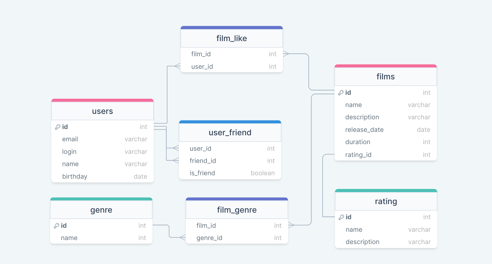

# Filmorate

Бэкенд сервиса для оценки фильмов

<details>
  <summary>
    <h2>Устройство базы данных</h2>
  </summary>
  <p>

### Диаграмма БД

### Примеры запросов

#### Получить список всех пользователей:
```sql
SELECT * 
FROM user
LEFT JOIN user_friend ON (id = user_id)
```

#### Найти пользователя по id:
```sql
SELECT * 
FROM user
LEFT JOIN user_friend ON (id = user_id)
WHERE id = @userId
```

#### Получить общих друзей:
```sql
SELECT friend_id
FROM user_friend
WHERE (user_id = @user1 OR user_id = @user2)
GROUP BY friend_id
HAVING COUNT(friend_id > 1)
```

#### Получить фильм по id:
```sql
SELECT *
FROM film
WHERE id = @filmId
```

#### Получить первые N самых популярных фильмов:
```sql
SELECT id,
       name,
       COUNT(film_id)
FROM film
LEFT JOIN film_like ON id = film_id
GROUP BY id
ORDER BY COUNT(id) DESC
LIMIT @N
```
  </p>
</details>
